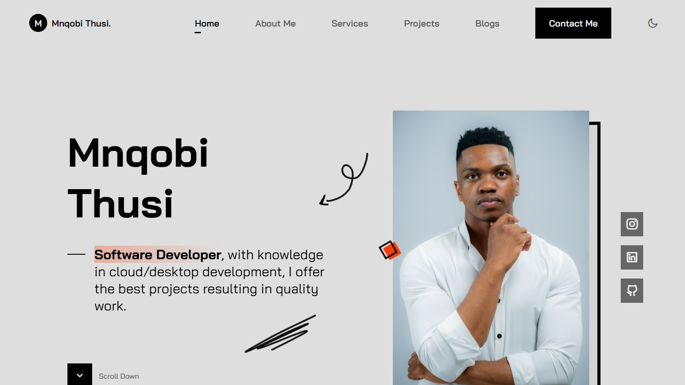

# mnqobithusi.dev

You are free to view and learn from this code, but reuse, reproduction, or redistribution is not permitted without written permission.

# Preview

---

**Personal Portfolio Website**  
Created and maintained by [Mnqobi Thusi](https://mnqobithusi.dev)  
🚀 Showcasing my work, skills, and services in programming, web & app development.

---

## 🧠 About This Site

This is my official portfolio platform designed to:

- Present my technical and creative work
- Serve as a contact point for freelance or contract opportunities
- Evolve into a platform offering paid freelance programming and app development services

---

## 🔒 License & Ownership

Unless stated otherwise:

- All source code and assets on this website are the **intellectual property of Mnqobi Thusi**.
- **All rights reserved**. You may not copy, clone, or reuse any part of this site without explicit permission.

### 🔓 Exceptions

If any open-source code or resources are included in specific folders (e.g., `/projects`), the license for those will be clearly indicated (e.g., MIT License inside the project folder).

---

## 📬 Contact Me

Want to work with me? Reach out here:

- 🌐 Website: [mnqobithusi.dev](https://mnqobithusi.dev)
- 📧 Email: [contact@mnqobithusi.dev]
- 🧑🏾‍💻 GitHub: [github.com/mnqobithusi](https://github.com/CodexLoop)

---

> This site is currently in active development — stay tuned for more updates and live projects soon.
